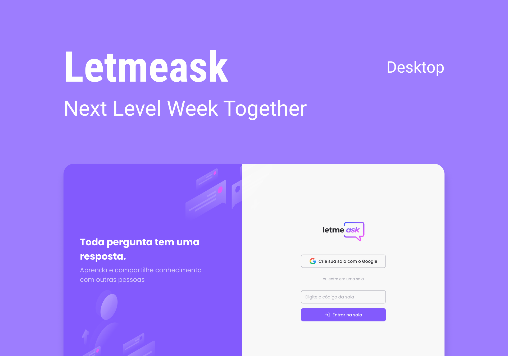

<div align="center">
  
</div>

<h3 align="center">
  Answer your audience's questions in real time.
</h3>
<h4 align="center">
  :rocket: NLW/Together
</h4>

---

## :bookmark_tabs: Table of contents

- [About](#page_facing_up-about)
- [Technologies](#test_tube-technologies)
- [Getting started](#computer-getting-started)
- [License](#memo-license)

## :page_facing_up: About

#### Layout on Figma: [Letmeask – Figma](https://www.figma.com/file/u0BQK8rCf2KgzcukdRRCWh/Letmeask/duplicate)



## :test_tube: Technologies

- [ReactJS](https://reactjs.org/)
- [TypeScript](https://www.typescriptlang.org/)
- [Node.JS](https://nodejs.org/en/)
- [Firebase](https://firebase.google.com/)

## :computer: Getting started

### Requirements

- **[Git](https://git-scm.com/)**
- **[Node.JS](https://nodejs.org/en/)**
- **[Yarn](https://yarnpkg.com/)** or **[NPM](https://www.npmjs.com/)**

```bash
  # Clone the repository
  $ git clone https://github.com/gjoao11/letmeask.git
  
  # Enter the project folder
  $ cd letmeask
  
  # Install the dependencies
  $ yarn
  
  # Run the application
  $ yarn start
  
  # Access the application in the browser
  http://localhost:3000
```

> It is necessary to create a Firebase Realtime Database and add the settings in an .env file.

```bash
  REACT_APP_API_KEY="API Key"
  REACT_APP_AUTH_DOMAIN="Auth Domain"
  REACT_APP_DATABASE_URL="Database URL"
  REACT_APP_PROJECT_ID="Project ID"
  REACT_APP_STORAGE_BUCKET="Storage Bucket"
  REACT_APP_MESSAGING_SENDER_ID="Messaging Sender ID"
  REACT_APP_APP_ID="APP ID"
```

## 	:memo: License

This project is under the [MIT License](https://github.com/gjoao11/letmeask/blob/main/LICENSE)
